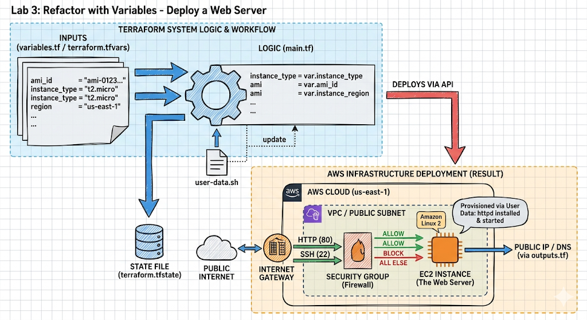

# 🚀 Lab 3: Refactoring Infrastructure with Terraform Variables


## 📋 Lab Description
This lab focuses on the **Refactoring** process. We take an existing Web Server deployment and replace hard-coded attributes (like AMI IDs, Instance Types, and Region names) with a flexible variable system. This allows the same code to be used for Development, Staging, and Production environments simply by changing a variable file.


## 🎯 Objectives
1.  **Extract Hard-coded Values:** Move strings and IDs out of `main.tf`.
2.  **Define Input Variables:** Create a `variables.tf` file with proper types and descriptions.
3.  **Automate Web Server Provisioning:** Use `user_data` to install Apache/Nginx.
4.  **Expose Infrastructure Data:** Use `outputs.tf` to show the Public IP and DNS.

---

## 🏗️ The Infrastructure
The lab deploys a secure Web Server architecture:
* **Provider:** AWS (configured via variables).
* **Compute:** EC2 Instance (Amazon Linux 2 / Ubuntu).
* **Security:** Security Group with Ingress rules for Port 80 (HTTP) and Port 22 (SSH).
* **Provisioning:** Bash script via `user_data` to start the web service.


---

## 📂 Project Structure
```text
.
├── main.tf           # Resource definitions (EC2, SG, VPC)
├── variables.tf      # Variable declarations and types
├── outputs.tf        # Data to be printed (Public IP, URL)
├── terraform.tfvars  # The actual values (Secret/Specific values)
└── scripts/
    └── install.sh    # (Optional) Shell script for user_data
```

---

## 🛠️ Implementation Steps

### 1. Refactor to `variables.tf`
Instead of using `"t2.micro"` inside your resources, you now define it here:
```hcl
variable "instance_type" {
  description = "The EC2 instance size"
  type        = string
  default     = "t2.micro"
}
```

### 2. Update `main.tf`
Link your resources to the variables:
```hcl
resource "aws_instance" "web_server" {
  ami           = var.ami_id
  instance_type = var.instance_type
  
  user_data = <<-EOF
              #!/bin/bash
              yum update -y
              yum install -y httpd
              systemctl start httpd
              systemctl enable httpd
              EOF
}
```

### 3. Capture Results in `outputs.tf`
Automatically see your website URL after deployment:
```hcl
output "website_url" {
  value = "http://${aws_instance.web_server.public_dns}"
}
```

---

## 🚀 Execution Guide

1.  **Initialize:** ```bash
    terraform init
    ```
2.  **Validate & Plan:**
    ```bash
    terraform validate
    terraform plan -var-file="terraform.tfvars"
    ```
3.  **Deploy:**
    ```bash
    terraform apply -var-file="terraform.tfvars" --auto-approve
    ```
4.  **Test:**
    Copy the `website_url` output and paste it into your browser.

---

## ⚠️ Common Pitfalls (Lab 3)
* **Variable Mismatch:** Ensure the variable name in `variables.tf` matches the `var.name` used in `main.tf` exactly.
* **Security Group Rules:** If the page doesn't load, ensure your Security Group allows `0.0.0.0/0` on port 80.
* **Missing `.tfvars`:** If you don't define a default value and don't use a `.tfvars` file, Terraform will prompt you manually for the value every time.

---
Kwame Nyador
**Date:** April 2026